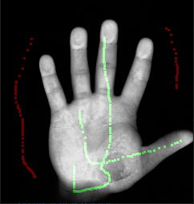
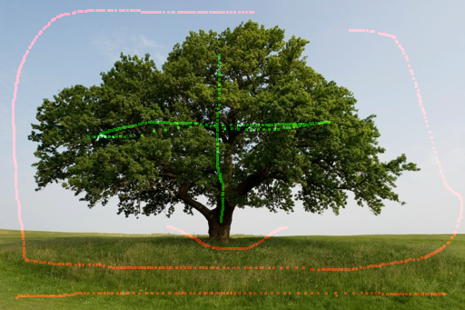
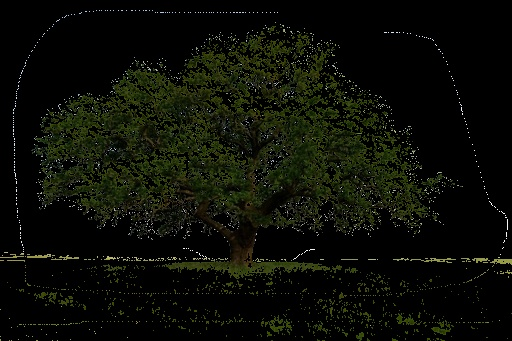
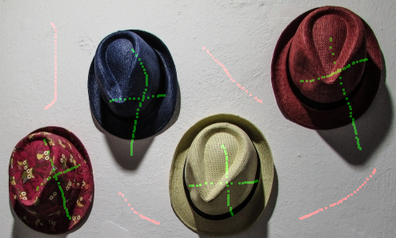

# GraphCut-Dinic

本项目参考了https://github.com/cm-jsw/GraphCut

主要复用了其UI逻辑，并参照论文

《interactive graph cuts for optimal boundary and region segmentation of objects in n-d images》

对图的构建进行了修改，以及通过Dinic算法实现了自己的maxflow库，替代官方maxflow库。

## 运行环境
python3.6 
所需库函数：numpy,opencv-python     
  
## 代码运行步骤
1. python GraphCut.py -i [输入文件名] -o [输出文件名]  
2. 使用鼠标进行前后背景标注（鼠标左键按住并拖动可进行连续标注）  
3. 功能：  
  （1）‘esc’：退出；  
  （2）‘c’：清除所有标注；  
  （3）‘g’：进行图片分割；  
  （4）‘t’：前后背景标准的切换；  
  （5）‘s’：将分割后的图片保存到输出文件。  

## 使图像分割效果更快更好
1. 进行更多标记
2. 在易混淆的边界处进行标记
3. 重新进行标记（支持玄学）

## 运行结果
| input+mark | output |
| :-----: | :-----: |
|  |  |
|  |  |
|  |  |
|  |  |

